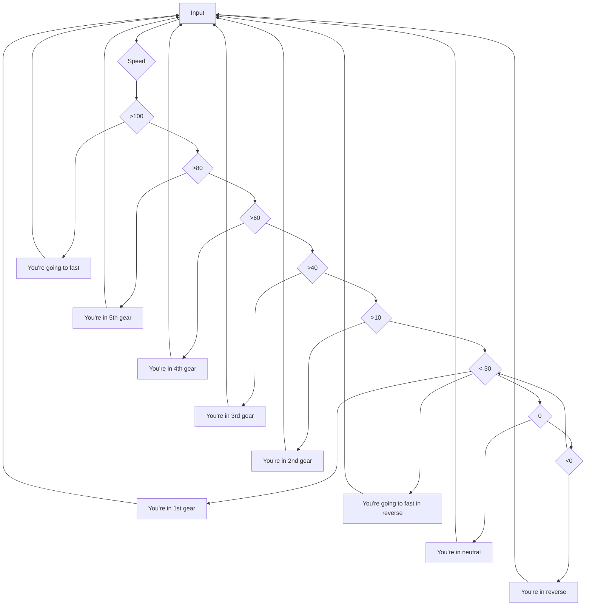

# Gearbox.
The gearbox will give you the gear it you in based on given speed.

Some foolproof parts in code are:
* Maximum speed (forward and backwards).
* Integer number instead of float as speed is difficult to give in floats.
* Warning if any of these are taken place.

