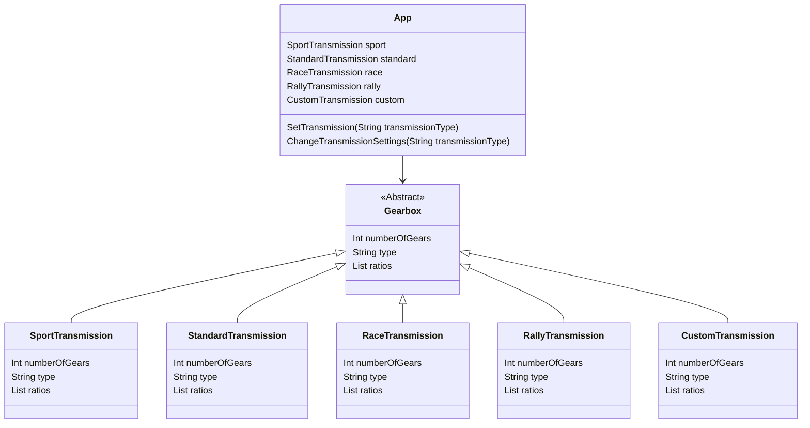

# Gearbox V2

A new version of gearbox with some changes.
These changes are mainly different gearboxes with different speeds per gear and number of gears.

The 4 standard gearboxes are:
  * Sport
  * Standard
  * Racecar
  * Rally

Next to these gearboxes, there is a change for the user to create a custom gearbox for the time the code runs.

The user inputs for this custom gearbox are:
  * Number of gears
  * Gear ratios
  * Name of gearbox
  
The class diagram is:

The flowdiagram is:
