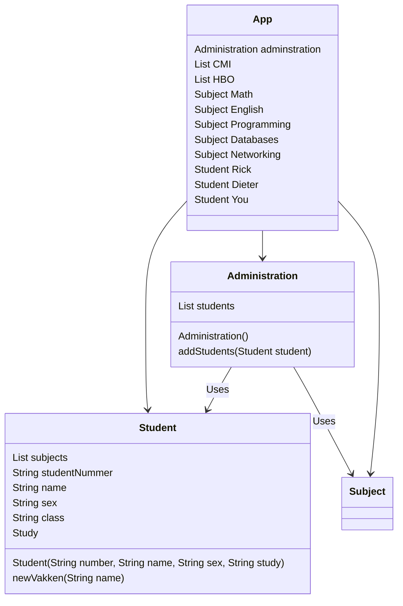
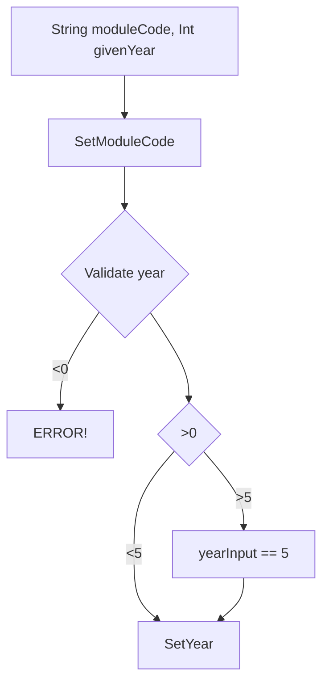
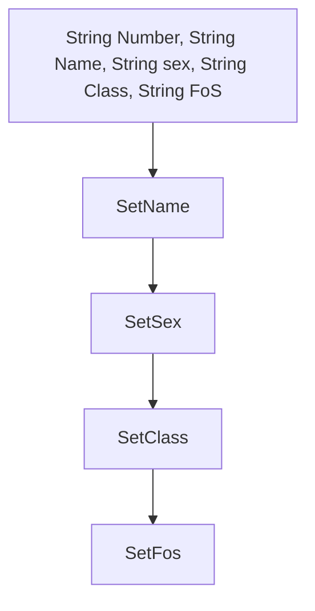
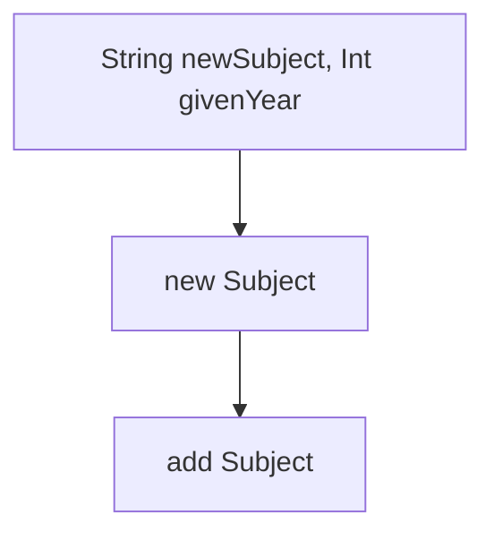
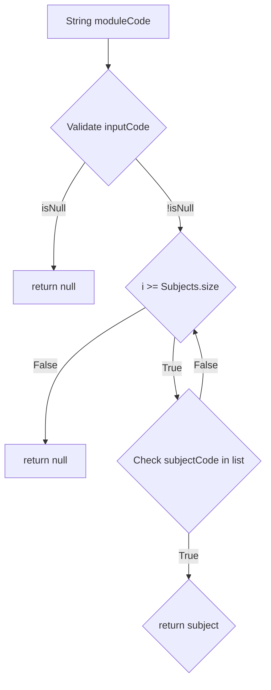
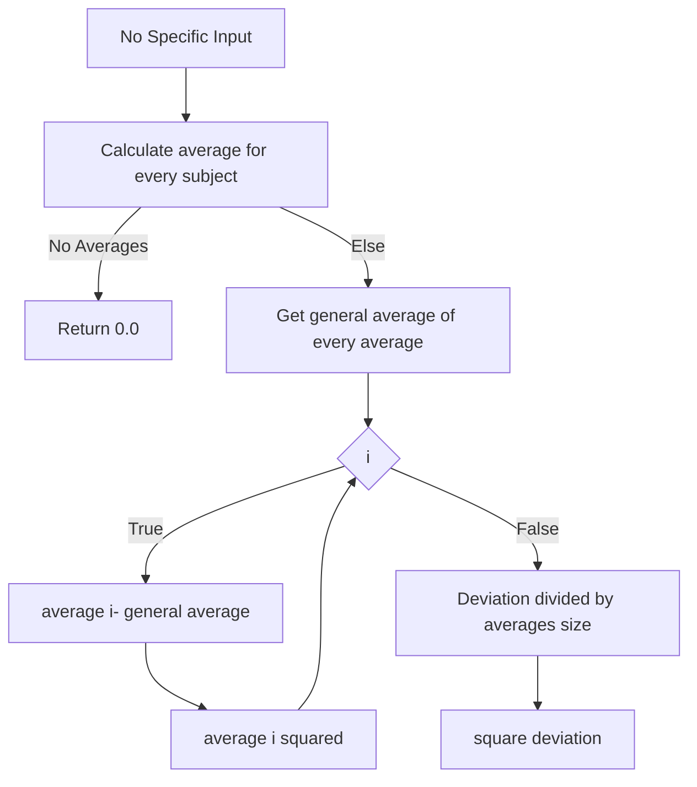

# School system:

This code will simulate a school system.

Some fool proof baked in:
* Numbers can only be assigned if subject and students are in system.
* Different classes for Students, Subjects, Administration and a main.

Class diagram of the schoolsystem is as following:



In the following flowcharts the custom functions are described. Getters and setters are not included as those are very standard procedures.

                                                      SUBJECT:
Variable:
  * Private List[Double] cijfers;
  * Private String moduleCode;
  * Private Int year;

              Initialization


                                                     STUDENT:
Variable:
  * Private List<Subject> subjects;
  * Private String studentNumber;
  * Private String name;
  * Private String gender;
  * Private String class;
  * Private String FoS;  
\\FoS is Field of Study

              Initialization

               newVakken

  
               getVak


               deviation
For better working use streams when possible.
  

  
                                                     Administration:
```mermaid
flowchart TD

```
