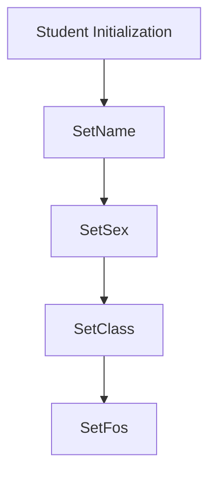

# School system:

This code will simulate a school system.

Some fool proof baked in:
* Numbers can only be assigned if subject and students are in system.
* Different classes for Students, Subjects, Administration and a main.

                  Subject:
Variable:
  * Private List[Double] cijfers;
  * Private String moduleCode;
  * Private Int year;

```mermaid
flowchart TD
  A[Subject Initialization] --> B[SetModuleCode] --> C{Validate year};
  C - <0 -> D[ERROR!];
  C --> E{>0}
  E - >5 -> F[yearInput == 5];
  E - <5 -> G[SetYear]
  F --> G[SetYear]
```

                 STUDENT:
Variable:
  * Private List<Subject> subjects;
  * Private String studentNumber;
  * Private String name;
  * Private String gender;
  * Private String class;
  * Private String FoS;    \\FoS is Field of Study


