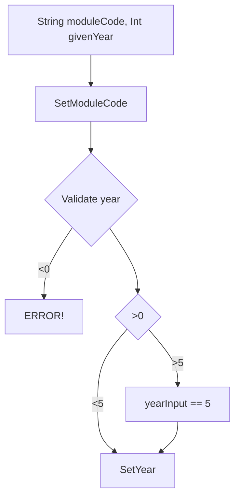
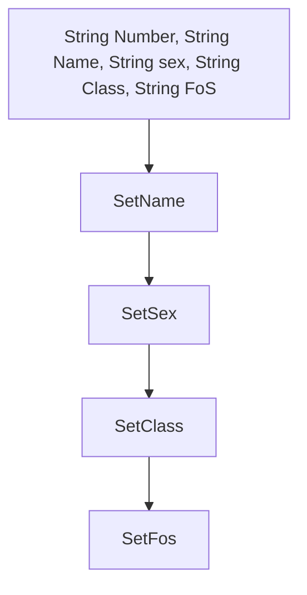
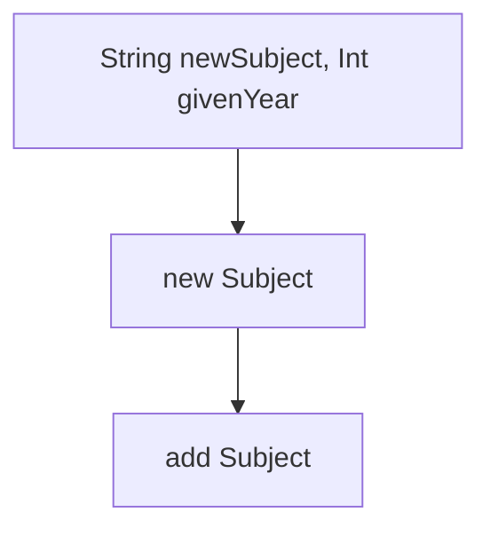
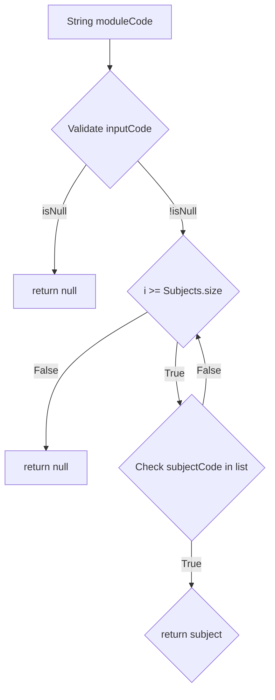

# School system:

This code will simulate a school system.

Some fool proof baked in:
* Numbers can only be assigned if subject and students are in system.
* Different classes for Students, Subjects, Administration and a main.

In the following flowcharts the custom functions are described. Getters and setters are not included as those are very standard procedures.

                                                      SUBJECT:
Variable:
  * Private List[Double] cijfers;
  * Private String moduleCode;
  * Private Int year;

              Initialization


                                                     STUDENT:
Variable:
  * Private List<Subject> subjects;
  * Private String studentNumber;
  * Private String name;
  * Private String gender;
  * Private String class;
  * Private String FoS;    \\FoS is Field of Study

              Initialization

               newVakken

  
               getVak


               deviation
```mermaid
flowchart TD
  A[No Specific Input] --> B[Calculate average for every subject];
  B -- No Averages --> C[Return 0.0];
  B -- Else --> C[Get general average of every average];
  C --> D{i <Averages.size};
  D -- True --> F[average i- general average];
  F --> G[average i squared];
  G --> D{i <Averages.size};  
  D -- False --> E[Deviation divided by averages size];
  E --> H[square deviation];
                                                     Administration:
```mermaid
flowchart TD

```
