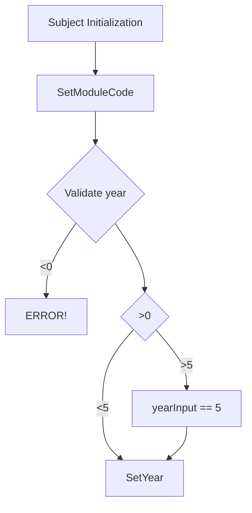
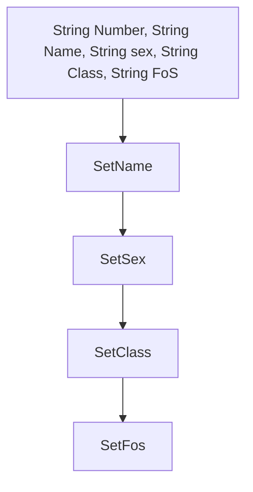
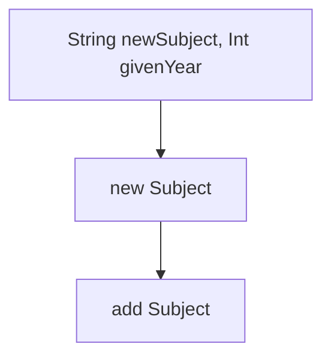
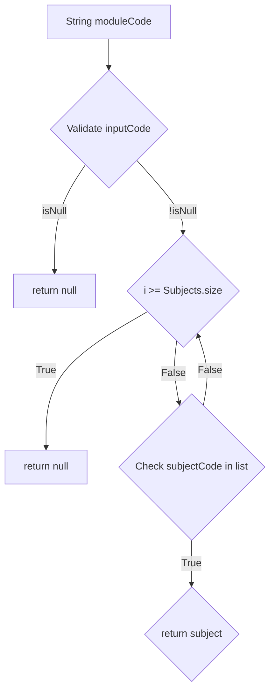

# School system:

This code will simulate a school system.

Some fool proof baked in:
* Numbers can only be assigned if subject and students are in system.
* Different classes for Students, Subjects, Administration and a main.

                                                      SUBJECT:
              Variable:
  * Private List[Double] cijfers;
  * Private String moduleCode;
  * Private Int year;



                                                     STUDENT:
              Variable:
  * Private List<Subject> subjects;
  * Private String studentNumber;
  * Private String name;
  * Private String gender;
  * Private String class;
  * Private String FoS;    \\FoS is Field of Study

              Initialization

               newVakken

  
               getVak

  
                                                     Administration:
```mermaid
flowchart TD

```
