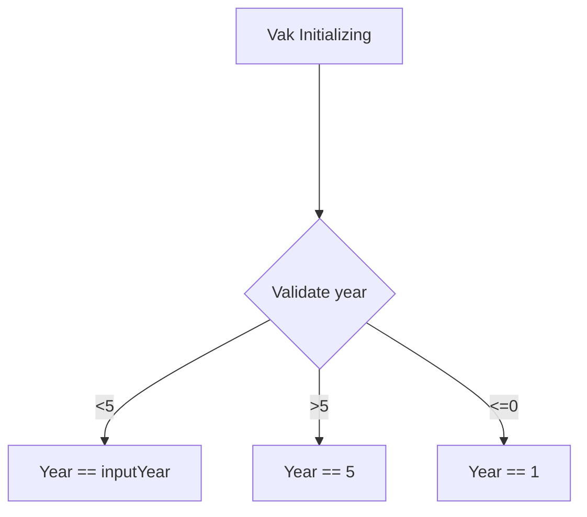

# School system:

This code will simulate a school system.

Some fool proof baked in:
* Numbers can only be assigned if subject and students are in system.
* Different classes for Students, Subjects, Administration and a main.

```mermaid
flowchart TD
  A[Vak Initializing] ----> B{Validate year};
  B -- >5 --> C[yearInput == 5];
  B -- <=0 --> D[ERROR!];
  B -- <5 --> E[SetYear "yearInput"]
  D ----> E[SetYear "yearInput"]
```


