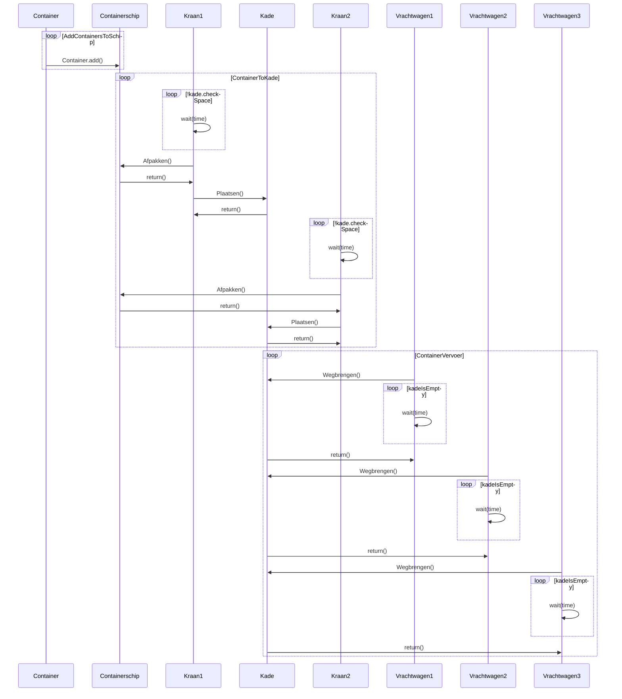
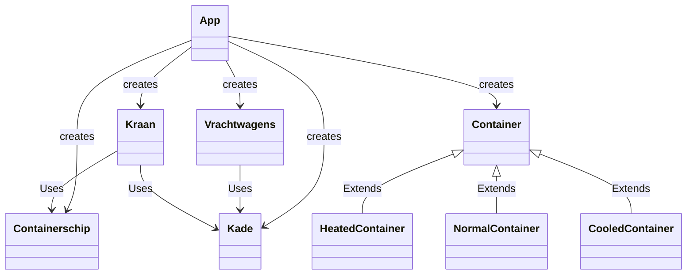

# Ship Quay simiultation:

Here will a ship quay simulated with schip, kranes and trucks. This all with multitreading.

```mermaid
sequenceDiagram
loop AddContainersToSchip
  Container->>Containerschip: Container.add()
end
loop ContainerToKade
  loop !kade.checkSpace
    Kraan1->>Kraan1: wait(time)
  end
  Kraan1->>Containerschip: Afpakken()
  Containerschip->>Kraan1: return()
  Kraan1->>Kade: Plaatsen()
  Kade->>Kraan1: return()
  loop !kade.checkSpace
    Kraan2->>Kraan2: wait(time)
  end
  Kraan2->>Containerschip: Afpakken()
  Containerschip->>Kraan2: return()
  Kraan2->>Kade: Plaatsen()
  Kade->>Kraan2: return()
end
loop ContainerVervoer
  Vrachtwagen1->>Kade: Wegbrengen()
  loop kadeIsEmpty
    Vrachtwagen1->>Vrachtwagen1: wait(time)
  end
  Kade->>Vrachtwagen1: return()
  Vrachtwagen2->>Kade: Wegbrengen()
  loop kadeIsEmpty
    Vrachtwagen2->>Vrachtwagen2: wait(time)
  end
  Kade->>Vrachtwagen2: return()
  Vrachtwagen3->>Kade: Wegbrengen()
  loop kadeIsEmpty
    Vrachtwagen3->>Vrachtwagen3: wait(time)
  end
  Kade->>Vrachtwagen3: return()
end
```

Flowchart of the program:

```mermaid
classDiagram
  App --> Containerschip : creates
  App --> Kraan : creates
  App --> Kade : creates
  App --> Container : creates
  App --> Vrachtwagens: creates
  Vrachtwagens --> Kade : Uses
  Kraan --> Containerschip : Uses
  Kraan --> Kade : Uses
  Container <|-- HeatedContainer : Extends
  Container <|-- NormalContainer : Extends
  Container <|-- CooledContainer : Extends
```
